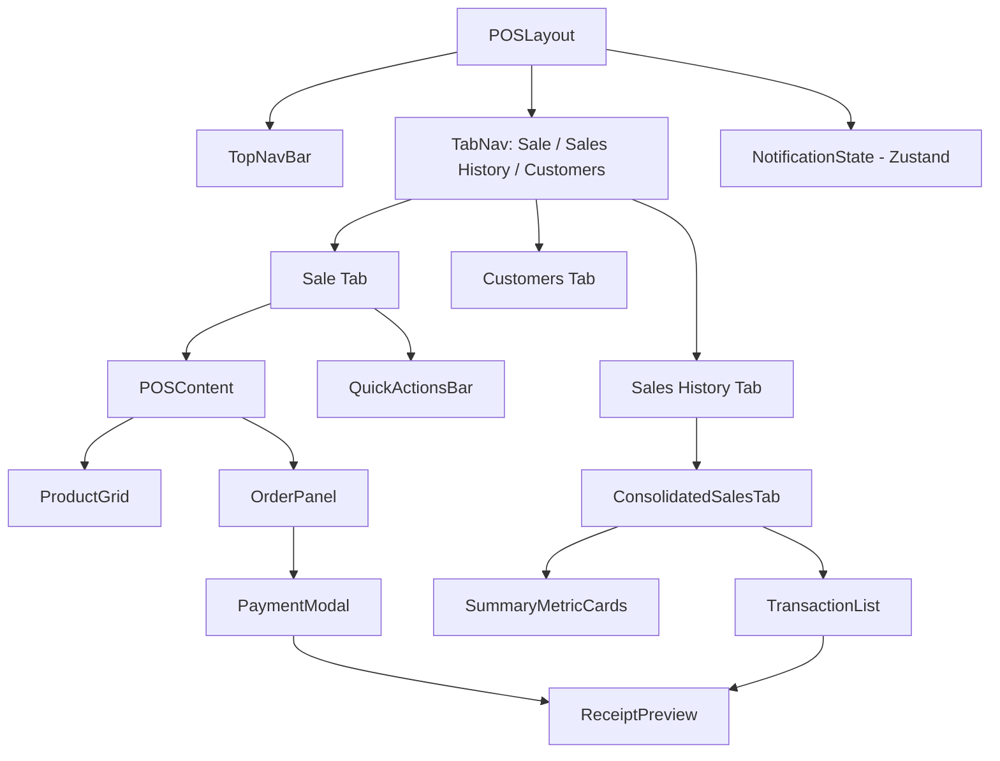

# Design Document: POS Advanced UI

## Overview

This design covers the modernization of the existing Point of Sale (POS) system. The primary goals are:

1. **Consolidate redundant screens** — remove the standalone `pos-analytics.tsx`, `inventory-management.tsx`, and `sales-reporting.tsx` tabs from the POS navigation.
2. **Elevate the visual design** — produce a focused, keyboard-friendly cashier interface.
3. **Replace `window.open` receipts** — render receipts inside an in-app Dialog.
4. **Wire all displayed data to live APIs** — eliminate hardcoded mock values from user-visible components.

The work is entirely within the Next.js 16 / React 19 frontend. No new backend routes are required; all necessary server actions already exist in `lib/actions/pos.actions.ts`, `lib/actions/customer.actions.ts`, and `lib/actions/warehouse.actions.ts`. State is managed with Zustand (`lib/store/pos-store.ts`).

---

## Architecture

The POS system lives under `app/(pos)/pos/page.tsx` and is composed of a layout shell (`POSLayout`) that owns the top navigation bar and tab routing, plus a set of feature components rendered inside each tab.

### Current structure (to be refactored)

```
POSLayout
├── Tab: "Point of Sale"  → POSContent (pos/page.tsx inline)
├── Tab: "Sales"          → SalesHistory
└── Tab: "Customers"      → CustomerManagement
```

`pos/page.tsx` also contains inline dialogs for Calculator, No-Sale, and Last Receipt, and calls `window.open` for receipt printing.

### Target structure

```
POSLayout (updated)
├── Tab: "Sale"           → POSContent + QuickActionsBar
├── Tab: "Sales History"  → ConsolidatedSalesTab
└── Tab: "Customers"      → CustomerManagement (unchanged)
```

Key architectural decisions:

- **`QuickActionsBar`** is a new thin component rendered only on the "Sale" tab, above `POSContent`.
- **`PaymentModal`** is extracted from the inline payment section of `POSContent` into its own component, triggered by a "Charge" button.
- **`ReceiptPreview`** replaces all `window.open` receipt calls; it is a Dialog-based component that accepts a `receiptData` prop.
- **`ConsolidatedSalesTab`** absorbs the summary metrics from `pos-analytics.tsx` and the transaction list from `sales-reporting.tsx` / `SalesHistory`.
- **Low-stock notification state** is lifted into `POSLayout` (or a small Zustand slice) so it persists across tab switches.



---

## Components and Interfaces

### `POSLayout` (updated — `components/pos/pos-layout.tsx`)

Responsibilities:
- Render the top navigation bar (logo, clock, online badge, notification bell, user menu).
- Render the three-tab navigation: "Sale", "Sales History", "Customers".
- Own the `notifications` state (array of `LowStockAlert`) and expose it via React context or prop-drilling to child components.
- Collapse tab labels to icons on screens narrower than 768 px (Tailwind `sm:` prefix).

```typescript
interface LowStockAlert {
  productId: string
  productName: string
  currentStock: number
  minStock: number
  timestamp: number
}

interface POSLayoutProps {
  children?: React.ReactNode
}
```

### `QuickActionsBar` (new — `components/pos/quick-actions-bar.tsx`)

A slim toolbar rendered only on the "Sale" tab, between the tab navigation and the main POS content.

```typescript
interface QuickActionsBarProps {
  onCalculator: () => void
  onNoSale: () => void
  onLastReceipt: () => void
}
```

Contains exactly three `Button` elements: "Calculator", "No Sale", "Last Receipt".

### `ProductGrid` (refactored from inline code in `pos/page.tsx`)

Extracted into `components/pos/product-grid.tsx`.

```typescript
interface ProductGridProps {
  products: Product[]
  loading: boolean
  onAddProduct: (product: Product, unit?: Unit) => void
  searchTerm: string
  onSearchChange: (value: string) => void
  selectedCategory: string
  onCategoryChange: (category: string) => void
  categories: string[]
}
```

Each product card renders: name, price, stock badge (color-coded: green ≥ minStock, yellow = low, red = 0), and an "Add" button. Zero-stock cards are visually disabled (`opacity-50 pointer-events-none`).

### `OrderPanel` (refactored from inline code in `pos/page.tsx`)

Extracted into `components/pos/order-panel.tsx`.

```typescript
interface OrderPanelProps {
  cart: CartItem[]
  selectedCustomer: Customer | null
  discount: number
  tax: number
  subtotal: number
  discountAmount: number
  taxAmount: number
  total: number
  onUpdateQuantity: (index: number, quantity: number) => void
  onRemoveItem: (index: number) => void
  onClearCart: () => void
  onSetDiscount: (value: number) => void
  onSetTax: (value: number) => void
  onSelectCustomer: (customer: Customer | null) => void
  onCharge: () => void
}
```

Decrement at quantity = 1 removes the item (delegates to `onUpdateQuantity(index, 0)` which the store handles as a remove).

### `PaymentModal` (new — `components/pos/payment-modal.tsx`)

Full-screen Dialog overlay triggered by the "Charge" button in `OrderPanel`.

```typescript
interface PaymentModalProps {
  isOpen: boolean
  onClose: () => void
  total: number
  paymentMethod: 'cash' | 'card' | 'mobile'
  cashReceived: string
  change: number
  isProcessing: boolean
  error: string | null
  onPaymentMethodChange: (method: 'cash' | 'card' | 'mobile') => void
  onCashReceivedChange: (value: string) => void
  onConfirm: () => void
}
```

- Keyboard: `Tab` cycles fields, `Enter` triggers confirm (when valid), `Escape` closes.
- Confirm button is disabled while `isProcessing` is true or when cash < total.
- On success: parent closes modal and opens `ReceiptPreview`.
- On error: `error` prop is set; modal stays open.

### `ReceiptPreview` (refactored — `components/pos/receipt-preview.tsx`)

Replaces `receipt-printer.tsx` and the inline `window.open` calls in `pos/page.tsx`.

```typescript
interface ReceiptPreviewProps {
  isOpen: boolean
  onClose: () => void
  receiptData: ReceiptData | null
}

interface ReceiptData {
  receiptNumber: string
  storeName: string
  warehouseName: string
  warehouseLocation: string
  cashierName: string
  timestamp: string
  items: ReceiptLineItem[]
  subtotal: number
  discount: number
  tax: number
  total: number
  paymentMethod: 'cash' | 'card' | 'mobile'
  cashReceived?: number
  change?: number
  customer?: {
    name: string
    email?: string
    loyaltyPointsEarned: number
  }
}

interface ReceiptLineItem {
  name: string
  unitLabel?: string
  quantity: number
  unitPrice: number
  lineTotal: number
}
```

Actions: Print (scoped `window.print()` via `@media print` CSS), Download (`receipt-{receiptNumber}.txt`), Email (calls email API when customer email present). On close, focus returns to the product search input.

### `ConsolidatedSalesTab` (new — `components/pos/consolidated-sales-tab.tsx`)

Replaces `SalesHistory`, `SalesComplete`, and `SalesReporting` in the POS navigation.

```typescript
interface ConsolidatedSalesTabProps {
  onReprintReceipt: (receiptData: ReceiptData) => void
}
```

Sections:
1. **Summary cards** (3): Today's Revenue, Transaction Count, Average Order Value — sourced from `getTodayStats()`.
2. **Transaction list**: fetched from `getTodaySales()`, sorted most-recent-first, with expand/collapse per row.
3. **Expanded row**: item breakdown, payment method, cashier name, "Reprint Receipt" button, "Void" button.
4. **Void dialog**: requires non-empty text reason before calling `voidSale()`.

### `CustomerSearchPopover` (new — `components/pos/customer-search-popover.tsx`)

Inline popover inside `OrderPanel` for attaching a customer to the current transaction.

```typescript
interface CustomerSearchPopoverProps {
  customers: Customer[]
  selectedCustomer: Customer | null
  onSelect: (customer: Customer | null) => void
  onCreateNew: () => void
}
```

Filters by name, phone, or email. Shows results after 2+ characters typed. "New Customer" shortcut opens `CustomerCreateDialog` without navigating away.

---

## Data Models

No new database models are required. The existing models are sufficient:

| Model | File | Used for |
|---|---|---|
| `Sale` | `lib/models/sales.models` | Transactions, void, history |
| `Product` | `lib/models/product.models` | Product grid, stock levels |
| `ProductBatch` | `lib/models/product_batch.models` | Stock validation on sale |
| `Customer` | `lib/models/customer.models` | Customer search, loyalty points |
| `CashDrawerEvent` | `lib/models/cash-drawer.models` | No-sale events |
| `Staff` | `lib/models/staff.models` | Cashier name on receipts |

### Zustand Store Extensions (`lib/store/pos-store.ts`)

Add a `notifications` slice to the existing store:

```typescript
interface NotificationSlice {
  lowStockAlerts: LowStockAlert[]
  addLowStockAlert: (alert: LowStockAlert) => void
  dismissAlert: (productId: string) => void
  clearAlerts: () => void
}
```

`lowStockAlerts` is **not** persisted across page reloads (session-only), so it is excluded from the `partialize` config.

After `processSale` succeeds, the POS page iterates the sold items, checks each product's remaining stock against its `minStock`, and calls `addLowStockAlert` for each product at or below threshold.

### Receipt Data Flow

```
processSale() returns Sale document
    ↓
buildReceiptData(sale, cart, customer, warehouse, cashier) → ReceiptData
    ↓
ReceiptPreview receives ReceiptData as prop
```

`buildReceiptData` is a pure utility function in `lib/utils/receipt-utils.ts`.

---

## Correctness Properties

*A property is a characteristic or behavior that should hold true across all valid executions of a system — essentially, a formal statement about what the system should do. Properties serve as the bridge between human-readable specifications and machine-verifiable correctness guarantees.*

### Property 1: Product card completeness

*For any* product in the product list, the rendered product card must contain the product name, a price display, a stock badge, and an interactive "Add" affordance.

**Validates: Requirements 2.1**

---

### Property 2: Search filter correctness

*For any* list of products and any non-empty search string, every product card visible after filtering must have a `name` or `sku` that contains the search string (case-insensitive).

**Validates: Requirements 2.2**

---

### Property 3: Zero-stock products are blocked

*For any* product whose `stock` field equals zero, the rendered card must be in a disabled state and the add action must not add the product to the cart.

**Validates: Requirements 2.3**

---

### Property 4: Category filter correctness

*For any* list of products and any selected category (other than "All"), every product card visible after filtering must belong to that category.

**Validates: Requirements 2.5**

---

### Property 5: Cart totals are mathematically correct

*For any* cart state (arbitrary items, unit prices, quantities), discount percentage `d`, and tax rate `t`:
- `subtotal = Σ (unitPrice × quantity)` for all items
- `discountAmount = subtotal × (d / 100)`
- `taxAmount = (subtotal − discountAmount) × (t / 100)`
- `total = subtotal − discountAmount + taxAmount`

The values displayed in the Order Panel must equal these formulas for all valid inputs.

**Validates: Requirements 3.5, 3.7, 3.8**

---

### Property 6: Quantity increment stays within stock bounds

*For any* cart item with `quantity < stock`, clicking increment must result in `newQuantity = quantity + 1` and must not exceed `stock`.

**Validates: Requirements 3.2**

---

### Property 7: Quantity decrement removes at one

*For any* cart item with `quantity > 1`, clicking decrement must result in `newQuantity = quantity − 1`. *For any* cart item with `quantity = 1`, clicking decrement must remove the item from the cart entirely.

**Validates: Requirements 3.3, 3.4**

---

### Property 8: Cash change calculation

*For any* cash payment where `cashReceived >= total`, the displayed change must equal `cashReceived − total` (rounded to 2 decimal places).

**Validates: Requirements 4.3**

---

### Property 9: Insufficient cash disables confirm

*For any* cash payment where `cashReceived < total`, the "Confirm Payment" button must be disabled and an error message must be visible.

**Validates: Requirements 4.4**

---

### Property 10: Duplicate submission prevention

*For any* sequence of N rapid clicks on "Confirm Payment" while a sale is processing, the sale processing API must be called exactly once.

**Validates: Requirements 4.6**

---

### Property 11: Receipt completeness

*For any* `ReceiptData` object, the rendered `ReceiptPreview` must display: store name, warehouse name, receipt number, date/time, cashier name, all line items with quantities and prices, subtotal, discount (when > 0), tax (when > 0), total, payment method, cash received and change (when payment method is cash), and customer name (when a customer is attached).

**Validates: Requirements 5.2**

---

### Property 12: Email button visibility

*For any* receipt data where `customer.email` is a non-empty string, the "Email Receipt" button must be visible in the `ReceiptPreview`.

**Validates: Requirements 5.5**

---

### Property 13: Loyalty points earned equals floor of total

*For any* completed sale with an attached customer and transaction total `T`, the loyalty points awarded must equal `Math.floor(T)`.

**Validates: Requirements 7.4**

---

### Property 14: Customer search filter correctness

*For any* list of customers and any search string of length ≥ 2, every customer displayed in the search popover must have a `name`, `phone`, or `email` that contains the search string (case-insensitive).

**Validates: Requirements 7.2**

---

### Property 15: Low-stock badge count accuracy

*For any* completed sale where exactly K products drop to or below their `minStock` threshold, the notification badge count must increase by exactly K.

**Validates: Requirements 9.1**

---

### Property 16: Alert dismissal decrements count

*For any* set of N low-stock alerts, dismissing one alert must result in exactly N − 1 alerts remaining and the badge count must equal N − 1.

**Validates: Requirements 9.3**

---

### Property 17: Alerts persist across tab switches

*For any* set of low-stock alerts present before a tab switch, the same alerts must be present after switching to a different tab and switching back.

**Validates: Requirements 9.4**

---

### Property 18: Transaction list sort order

*For any* list of transactions returned by the API, the transactions displayed in the Sales History tab must be sorted by `saleDate` descending (most recent first).

**Validates: Requirements 6.2**

---

## Error Handling

| Scenario | Behavior |
|---|---|
| `processSale` API error | `PaymentModal` stays open; error message shown inline; confirm button re-enabled for retry |
| `voidSale` API error | Error toast shown; transaction remains in list unchanged |
| `getTodaySales` / `getTodayStats` load failure | Error toast; empty state shown in Sales History tab |
| `getWarehouseProducts` failure | Error toast; empty product grid with retry button |
| `getCustomers` failure | Error toast; customer search popover shows empty state |
| Email receipt API failure | Error toast inside `ReceiptPreview`; dialog stays open |
| Insufficient stock on sale attempt | `processSale` throws; error message shown in `PaymentModal` |
| No warehouse selected | "Charge" button disabled; tooltip explains why |
| Empty cart | "Charge" button disabled; empty-state shown in `OrderPanel` |

All async operations use `try/catch` with `toast.error()` for user-facing errors. Loading states are tracked with local `useState` booleans and shown via spinner or skeleton components.

---

## Testing Strategy

### Unit Tests

The project currently has no test framework configured. The recommended setup is **Vitest** with **React Testing Library**, which integrates cleanly with Next.js and the existing TypeScript/Tailwind stack.

Install:
```bash
npm install --save-dev vitest @vitejs/plugin-react @testing-library/react @testing-library/user-event jsdom
```

Unit tests focus on:
- `buildReceiptData` utility — specific examples of correct output
- `POSStore` computed values (`getSubtotal`, `getDiscountAmount`, `getTaxAmount`, `getTotal`, `getChange`) — edge cases (empty cart, 0% discount, 100% discount)
- `ConsolidatedSalesTab` — renders summary cards, renders transaction list, void dialog requires reason
- `ReceiptPreview` — renders inside Dialog, not `window.open`; shows email button only when customer email present
- `PaymentModal` — disables confirm when cash < total; keyboard navigation

### Property-Based Tests

Use **fast-check** for property-based testing:

```bash
npm install --save-dev fast-check
```

Each property test runs a minimum of **100 iterations**. Tag format: `// Feature: pos-advanced-ui, Property N: <property text>`

**Properties to implement as PBT:**

| Property | Test file | Generator inputs |
|---|---|---|
| P2: Search filter correctness | `product-grid.test.ts` | `fc.array(fc.record({name, sku, ...}))`, `fc.string()` |
| P3: Zero-stock products blocked | `product-grid.test.ts` | `fc.record({stock: fc.constant(0), ...})` |
| P4: Category filter correctness | `product-grid.test.ts` | `fc.array(product)`, `fc.string()` |
| P5: Cart totals correctness | `pos-store.test.ts` | `fc.array(cartItem)`, `fc.float(0,100)` discount, `fc.float(0,100)` tax |
| P6: Quantity increment bounds | `pos-store.test.ts` | `fc.record({quantity, stock})` where `quantity < stock` |
| P7: Quantity decrement / remove | `pos-store.test.ts` | `fc.integer({min:1})` quantity |
| P8: Cash change calculation | `payment-modal.test.ts` | `fc.float()` cashReceived, `fc.float()` total where `cashReceived >= total` |
| P9: Insufficient cash disables confirm | `payment-modal.test.ts` | `fc.float()` cashReceived, `fc.float()` total where `cashReceived < total` |
| P10: Duplicate submission prevention | `payment-modal.test.ts` | `fc.integer({min:2, max:10})` click count |
| P11: Receipt completeness | `receipt-preview.test.ts` | `fc.record(ReceiptData)` with all fields |
| P12: Email button visibility | `receipt-preview.test.ts` | `fc.emailAddress()` for customer email |
| P13: Loyalty points = floor(total) | `pos-store.test.ts` | `fc.float({min:0.01})` total |
| P14: Customer search filter | `customer-search-popover.test.ts` | `fc.array(customer)`, `fc.string({minLength:2})` |
| P15: Low-stock badge count | `pos-layout.test.ts` | `fc.array(product)` with stock at/below minStock |
| P16: Alert dismissal decrements | `pos-layout.test.ts` | `fc.array(alert, {minLength:1})` |
| P17: Alerts persist across tabs | `pos-layout.test.ts` | `fc.array(alert)`, `fc.constantFrom('sale','sales-history','customers')` |
| P18: Transaction sort order | `consolidated-sales-tab.test.ts` | `fc.array(fc.record({saleDate: fc.date()}))` |

Properties P1 (card completeness) is better covered as an example-based test since it tests rendering structure rather than a universal invariant over varying inputs.

### Integration Tests

- Warehouse selector change triggers product reload (mock `getWarehouseProducts`)
- Sale success flow: `processSale` mock → modal closes → `ReceiptPreview` opens
- Void flow: `voidSale` mock success/failure → correct UI response
- Sales tab load: `getTodaySales` + `getTodayStats` mocks → correct data displayed

### Test File Structure

```
__tests__/
  pos/
    pos-store.test.ts
    product-grid.test.ts
    order-panel.test.ts
    payment-modal.test.ts
    receipt-preview.test.ts
    consolidated-sales-tab.test.ts
    customer-search-popover.test.ts
    pos-layout.test.ts
    quick-actions-bar.test.ts
  utils/
    receipt-utils.test.ts
```
